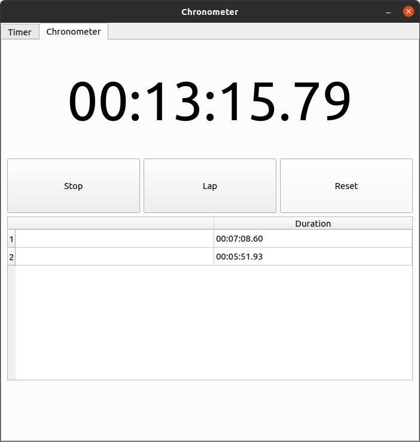

# Chronometer
A desktop application of count up timer and stopwatch that is written with C++ and qt.

# Screenshots
 

# Build
use following commands to build the project:

    git clone https://github.com/fatemehkarimi/Chronometer.git
    cd Chronometer
    mkdir build
    cd build
    qmake ../Chronometer.pro
    make
    ./Chronometer
